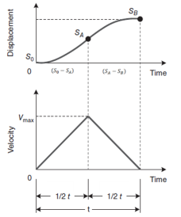

# Control de movimiento clase 20/03/25
# Introducción

# 1. Perfiles de movimiento
Como su nombre lo indica, es la trayectoria de la carga desde un punto A hasta un punto B, este movimiento puede variar según el sistema utilizado. En un solo eje, el movimiento es lineal y sigue una dirección única, mientras que en sistemas multieje las trayectorias se vuelven más complejas, combinando movimientos en diferentes direcciones. El perfil de movimiento describe el comportamiento del sistema en términos de posición, velocidad, aceleración e incluso el jerk (tasa de cambio de la aceleración), lo que permite optimizar la suavidad del desplazamiento.

# 2. Cinemática
Estudia el comportamiento de la posición s(t), la velocidad v(t) y la aceleración a(t) en función del tiempo. En un sistema de un solo eje s(t) describe la posición en cualquier instante, v(t) el cambio de posición respecto al tiempo (derivada de la posición) y a(t) define la variación de la velocidad en un lapso (derivada de la velocidad).Sin embargo, no basta con conocer únicamente las posiciones inicial (A) y final (B), sino que también es crucial analizar la trayectoria del sistema y cómo se lleva a cabo el movimiento, ya que esto determina la dinámica, eficiencia y suavidad del proceso.

(imagen de matematicamente como son)
(imagen de las curvas)

Mediante el análisis de las imágenes, se pueden deducir ecuaciones gobernadas por reglas geométricas.

## 2.1 Reglas geométricas
La trayectoria del sistema depende de los tiempos de proceso, mientras que su perfil de movimiento se obtiene analizando el perfil de velocidad (espacio/tiempo). A partir de esto, se establecen las siguientes ecuaciones: 

$$v = v_{0}+ \color{Magenta} a \color{Yellow} (t- t_{0})$$

* $$\color{Magenta} a$$ es la pendiente del perfil de velocidad.
* El perfil tiene varias etapas de proceso. por esa razón se tiene en cuenta $$t_{0}$$ . En alguna otra etapa este valor ya no será 0, y afecta el valor de velocidad obtenido.

$$s= s_{0}+\frac{1}{2}\color{Red} (t-t_{0})\color{Cyan} (v_{0}+a(t-t_{0}))$$

## 💡Ejemplo 1:
Encontrar la posición y la aceleración en t= 5 segundos.

(Insertar la imagen de las graficas)

Solución:

$$a =(10 in/s)/(5s) = 2 s^{2}$$

Ahora para la posición:

$$s = 0+\frac{1}{2}(5)(10) = 25 in$$

En la anterior ecuación se puede apreciar como la posición es el área del triangulo que se forma en el perfil de velocidad. Y el area no es más que $$(base*altura)/2$$ y se suma por la posición inicial. En alguna otra etapa del proceso u otro proceso, este valor ya no será 0. 

## 💡Ejemplo 2:
Un eje está viajando a una velocidad de 10 cm/s. En t=5 s empieza a disminuir la velocidad como se ve en el perfil. Cual es la posición del eje cuando se detiene? Asuma que empieza a acelerar a 25 cm.

(intertar imagen de las gráficas)

Solución: 

$$a = \frac{0-10}{15-5} = -1 cm/s^{2}$$

$$s = 25 + \frac{10*10}{2}= 75 cm$$

(Insertar la imagen de matlab)

## 2.2 Perfiles de movimiento comunes

En el diseño de perfiles de movimiento, los dos enfoques más comunes son el trapezoidal (ampliamente utilizado por su facilidad de análisis, basado en las ecuaciones geométricas mencionadas) y la curva S (sigmoidal o gaussiana). Mientras el perfil trapezoidal prioriza la rapidez, la curva S ofrece mayor suavidad a costa de un tiempo de recorrido ligeramente mayor. Sin embargo, un factor crítico en ambos casos es el jerk (cambio brusco de aceleración), representado matemáticamente como pulsos o deltas de Dirac. Este fenómeno genera fuerzas repentinas que pueden dañar componentes mecánicos, como los ejes de un motor, debido a tensiones o flexiones indeseadas. Por ello, los sistemas de control modernos permiten ajustar y minimizar el jerk, optimizando así la durabilidad y precisión del movimiento.

(Insertar grafica)

### 2.2.1 Perfil de velocidad trapezoidal Geométrico 

(Insertar mi grafica) 

Como se aprecia en la imagen, el modelo asume tiempos iguales para las fases de aceleración y desaceleración. No obstante, en aplicaciones reales esta simetría no siempre se cumple: existen sistemas que requieren una desaceleración más rápida por requisitos de seguridad, o una aceleración prolongada para alcanzar velocidades críticas. Estas variaciones responden a necesidades específicas de desempeño del sistema. 

$$t_{a}=t_{d}=\frac{V_{m}}{a}$$

El tiempo total del movimiento sería entonces:

$$t_{TOTAL}=t_{a}+t_{m}+t_{d}$$

Ahora bien, para conocer el recorrido total L:

$$L= \frac{t_{a}v_{m}}{2}+t_{m}v_{m}+\frac{t_{d}v_{m}}{2}$$

$$L= v_{m}(t_{a}+t_{m})$$

Y despejando de la ecuación anterior se puede conocer el tiempo de movimiento, que sería:

$$t_{m}=\frac{L}{v_{m}}-t_{a}$$

### 2.2.2 Perfil de velocidad trapezoidal Anlítico 

(Insertar grafica) 
(Poner ecuaciones analiticas) 

## 💡Ejemplo 3:
El eje x de un robot Gantry debe moverse 10 cm, La máxima aceleración permitida en este eje es de $$ 1cm/s^{2}$$. Si se desea mover el eje a una velocidad máxima de 2 cm/s, cuanto tiempo tomará hacer este movimiento.

(Insertar imagen)

$$t_{a}= t_{d}=\frac{2 cm/s}{\frac{2}{2}} = 2 s$$

$$t_{m}= \frac{10 cm}{2 cm/s}-2 s = 3s$$

$$t_{TOTAL}= 2s+3s+2s = 7s$$

(Insertar trapezoidal que hare yo)

# 📚 Ejercicios
1. Dado el perfil de velocidad de la figura, calcule $$S_{A},S_{B},S_{C}$$ usando las reglas geométricas y el método analítico del perfil del movimiento.
 (Insertar grafico)

   Solución:

   * Método Geométrico
     
     $$S_{A}= \frac{(0.5)(4)}{2}+0 = 1cm$$
     
     $$S_{B}= 2\frac{(4)(5)}{2}+1 = 21cm$$
     
     $$S_{C}= \frac{(0.5)(4)}{2}+21 = 22cm$$

   * Método analítico

     $$S_{A}= \frac{1}{2}(8)(0.5)^{2}= 1cm$$

     $$S_{B}= 1+4(5.5-0.5)= 21cm$$

     $$S_{C}= 21+\left[ 4(6)-\frac{1}{2}(-8)(6-5.5)^{2} \right]=22 cm$$

Se confurma que con ambos métodos la posicion A será en 1 cm, la posición B en 21 cm y la posición c en 22 cm.

27 / 04 / 2025
# Perfil de Movimiento - Parte 2 

Con el objetivo de recordar lo visto en la clase pasada, se propone el siguiente ejemplo.
## 💡Ejemplo 1:

- Dado el perfil de velocidad simétrico de la figura 1, calcule la máxima velocidad y la aceleración máxima.

Figura 1. Perfil de velocidad simétrico 

Solución:

$$S_{B} = {\color{Red}\frac{1}{2}v_{max}\frac{t}{2}} + {\color{Green}\frac{1}{2}v_{max}\frac{t}{2}}$$

Se consideran ambas partes de la curva: la ecuación en rojo corresponde al segmento A, mientras que la ecuación en verde representa el segmento B.

$$S_{B} = \frac{1}{2}v_{max}t$$

En la gráfica de velocidad el tiempo de movimiento es igual a 0.

$$v_{max} = \frac{2_{S_{B}}}{t}$$

$$a = \frac{2v_{max}}{t}$$

# Perfil de velocidad curva en S
La curva en S se utiliza en perfiles de movimiento para suavizar la transición entre las distintas fafes de desplazamiento, reduciendo así las vibraciones mecánicas y los esfuerzos sobre los componentes del sistema. A diferencia de los perfiles lineales, en los que los camibos de aceleración ocurren de forma repentina, la curva en S introduce una transición gradual que mejora significativamente el comportamiento dinámico del sistema.

- Perfil de Posición:
  - En ambos casos, al integrar el perfil de velocidad se obtiene una función de tercer orden para la posición. Sin embargo, en el perfil con curva en S, el crecimiento de a posición es más progresivo y continuo, sin cambios bruscos de pendiente. Esto se traduce en un desplazamiento más fluido y preciso.
  
    
Figura 2. Perfil de Posición

- Perfil de Aceleración:
  - Perfil Lineal: La aceleración se presenta en forma de escalones o saltos repentinos. En cada etapa del movimientp (aceleración constante, velocidad constante, desaceleración), la aceleración cambia bruscamente de valor, lo que puede generar impactos al sistema.

  - Perfil Curva en S: La aceleración es continua y suave. Está compuesta por tres fases: Pendiente positiva (incrementa la aceleración), constante, y una pendiente negativa (disminuye la aceleración). Este comportamiento se representa mediante funciones cuadráticas (segund orden), lo que hace que al derivar para obtener el Jeck sea lineal.
  
    
Figura 3. Perfil de Aceleración

- Perfil de Jeck: 
  - Perfil Lineal: Se aprecian saltos abruptos, ya que la aceleración cambia de forma instantánea.
  - Perfil Curva en S: Se observa una transición continua con cambios suaves.
    
     
Figura 4. Perfil de Jeck

Se encuentra 2 clases de curvas en S:
1. Perfiles S pura: 2 modelos de segundo orden conectados entre ellos; este perfil es mucho más suave.
2. Perfiles en S: Si 2 modelos de segundo orden y un modelo de primer orden en la mitad.

# Modelo matemático

Cada segmento curvo del perfil de velocidad respecto al tiempo (t) se modela mediante un polinomio de segundo orden, el cual permite una transición gradual entre diferentes niveles de velocidad. La expresión matemática del perfil de velocidad es:

$$v(t) = C_{1}(t)^2 + C_{2}(t) + C_{3}$$

$$C_{1}, C_{2} y C_{3}$$ son coeficientes determinados a partir de las condiciones de frontera, es decir, las condiciones iniciales y finales del movimiento (como la velocidad, aceleración o posición en instantes específicos).

Este tipo de polinomio permite definir un perfil de aceleración continua, lo cual es fundamental para evitar esfuerzos mecánicos excesivos y para mejorar la eficiencia energética del sistema.

El perfil curva S se caracteriza por tener una aceleración que varía de manera continua, iniciando desde cero, alcanzando un valor máximo, y luego regresando nuevamente a cero, lo cual evita los cambios abruptos que se presentan en perfiles trapezoidales.

A continuación se evalúan las condiciones de frontera 

## 💡Ejemplo  2

Curva A:
En el tiempo igual a 0 (cero), la velocidad vale 0 y al derivar la velocidad para hallar la aceleración se determina que también es 0.
El tiempo final es t/2, por ende, debe llevar la mitad de la velocidad.

Fronteras

$$0 < t < \frac{t_{a}}{2}$$

Límites iniciales 

$$v(0) = 0$$
$$a(0) = \frac{dv}{dt} = 0$$

Límites finales

$$v(\frac{t_{a}}{2}) = \frac{v_{m}}{2}$$
$$a(\frac{t_{a}}{2}) = a$$

Se evalúa el polinomio para hallar C1, C2 y C3

$$v(0) = C_{1}(0)^2 + C_{2}(0) + C_{3} = 0$$
$$ C_{3} = 0$$

$$v(\frac{t_{a}}{2}) = \frac{C_{1}t_{a}^2}{4} = \frac{v_{m}}{2}$$
$$C1 = \frac{2v_{m}}{t_{a}^2}$$
$$v(t) = \frac{2vm}{t_{a}^2}t^2$$

Ahora se escriben las ecuaciones para hallar los valores de los coeficientes:

$$v(t) = C_{1}(t)^2 + C_{2}(t) + C_{3}$$
$$a(t) = 2C_{1}(t) + C_{2}$$

1. $$a(t_{a}) = 2C_{1}(t_{a}) + C_{2} = 0$$
2. $$a(\frac{t_{a}}{2}) = C_{1}(t_{a}) + C_{2} = a$$
 
 Despeje de los coeficientes:

- Coeficiente $$C_{1}$$:
  
$$C_{1}t_{a} + a - C_{1}t_{a} = 0$$

$$C_{1}(2t_{a} - t_{a}) = -a$$

$${\color{Red}C_{1} = \frac{-a}{t_{a}}}$$

- Coeficiente $$C_{2}$$:
  
$$\frac{a}{\color{Green} {t_{a}}}{\color{Green} {t_{a}}} + C_{a} = a $$
  
$${\color{Red}C_{2} = 2a}$$

- Coeficiente $$C_{3}$$:

$$\frac{-a}{t_{a}}(t_{a})^2 + 2at_{a} + C_{3} = v_{m}$$

$$-at_{a} + 2at_{a} + C_{3} = v_{m}$$

$$C_{3} = v_{m} + at_{a} - 2at_{a}$$

$${\color{Red}C_{3} = v_{m} - at_{a}}$$

Ahora se resuelve teniendo en cuenta los coeficientes:

$$v_A(t) = \frac{2v_m}{t_a^2} t^2 \quad\quad 
v_B(t) = v_m - \frac{2v_m}{t_a^2}(t_a - t)^2$$

$$s(t) = \int_{0}^{15} \frac{2 \cdot 32}{30^2} t^2 \, dt + \int_{15}^{30} 32 - \frac{2 \cdot 32}{30^2}(30 - t)^2 \, dt$$

$$s(t) = \int_{0}^{15} \frac{64}{900} t^2 \, dt + \int_{15}^{30} 32 - \frac{64}{900}(30^2 - 60t + t^2) \, dt$$

Obtener la posición (axis) transcurridos 100 ms a partir del perfil de velocidad:

$$s_OB(t) = [0.023 * t^3]from t=0 to t=15 + [32 * t + 0.071 * (900 * t - (60 / 2) * t^2 + (t^3) / 3)] from t=15 to t=30$$

$$s_{OB}(t) = 77.62 + 480 - 64.12 = 493.49 \text{ cts}$$

$$s_{OC}(t) = 493.49 + 32 \cdot 70 = 2733.49 \text{ cts}$$

# Movimiento Multieje

Los sistemas que requieren el control simultáneo de múltiples ejes como manipuladores, los cuales utilizan perfiles de movimiento multi-eje. Este tipo de perfiles se basan en la coordinación precisa entre dos o más ejes (axis) para lograr un trayecto o acción específica de forma sincronizada.

Se debe tener en cuenta los siguientes movimientos:

### Movimiento Secuencial:
- Mueve un eje primero, seguido del otro. Es una forma simple pero lenta en dado caso de requerir una precisión conjunta.

### Movimiento Simultáneo:
- Ambos ejes se activan al mismo tiempo, pero sin una sincronización total de velocidad o trayectoria.

### Movimiento Interpolado:
- Ambos ejes son controlados para iniciar y terminar exactamente al mismo tiempo, manteniendo una trayectoria precisa, como una línea recta en el espacio cartesiano.
- Se puede usar una interpolación lineal o circular, dependiendo de la trayectoria deseada

## 💡Ejemplo 3

Considere la máquina de la figura. Si ambos ejes se mueven a una velocidad de 4 cm/s usando un perfil de velocidad trapezoidal con 洧노洧녩 = 0,2 s, 쮺uánto tiempo le tomará a cada eje completar el movimiento?

$$t_{a} = 0.2s,      L_{x} = 16cm,  v_{x} = 4 cm/s$$
$$L_{y} = 12cm,   v_{y} = 4 cm/s$$

$$tx_{m} = \frac{L_{x}}{v_{m}} - t_{a}$$

$$tx_{m} = \frac{16cm}{4 cm/s} - 0.2 = 3.8s$$

$$ {\color{Green} tx_{total} = 3.8 + 2t_{a} = 4.2s} $$

$$ty_{m} = \frac{L_{y}}{v_{m}} - t_{a}$$

$$ty_{m} = \frac{12cm}{4 cm/s} - 0.2 = 2.8s$$

$${\color{Green} ty_{total} = 2.8 + 2t_{a} = 3.2s} $$

## 💡Ejemplo 4
Para el ejemplo anterior, ahora se debería tomar como referencia el perfil de velocidad del eje (axis) que tomará mas tiempo e interpolar para el otro eje (axis), para que ambos terminen al mismo tiempo.

$$v_{x} = 4 cm/s,  t_{a} = 0.2s,   v_{y} = ?$$

$$t_{m} = \frac{L_{y}}{t_{m} + t_{a}} = \frac{12cm}{3.8 + 0.2} = 3 cm/s$$

$$ {\color{Green} v_{y} = 3 cm/s}$$

# 📚 Ejercicios

Considere la máquina de la figura. Si ambos ejes se mueven a una velocidad de 8 cm/s usando un perfil de velocidad trapezoidal con 洧노洧녩 = 0,6 s, 쮺uánto tiempo le tomará a cada eje completar el movimiento?

$$t_{a} = 0.6s,      L_{x} = 45cm,  v_{x} = 8 cm/s$$
$$L_{y} = 20cm,   v_{y} = 8 cm/s$$

$$tx_{m} = \frac{L_{x}}{v_{m}} - t_{a}$$

$$tx_{m} = \frac{45cm}{8 cm/s} - 0.6 = 5.025s$$

$$ {\color{Green} tx_{total} = 5.025 + 2t_{a} = 5.625s} $$

$$ty_{m} = \frac{L_{y}}{v_{m}} - t_{a}$$

$$ty_{m} = \frac{20cm}{8 cm/s} - 0.6 = 1.9s$$

$${\color{Green} ty_{total} = 1.9 + 2t_{a} = 2.5s} $$

# Conclusiones
- Implementar un perfil de movimiento con curva en S permite una transición más suave entre etapas, reduciendo las vibraciones, mejorando la precisión del posicionamiento y alargando la vida útil de los componentes mecánicos. Aunque su implementación puede requerir mayor complejidad.

# Referencias

